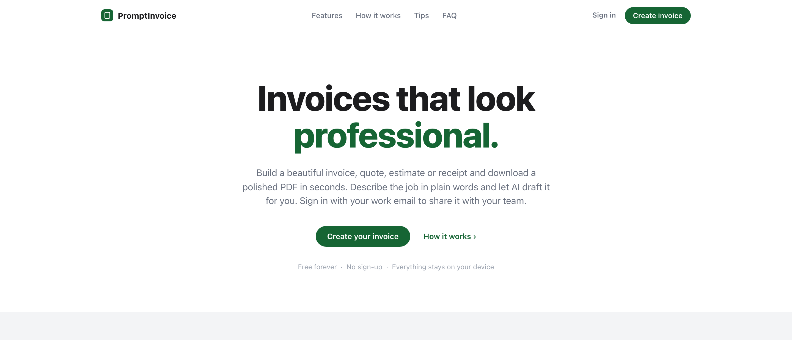
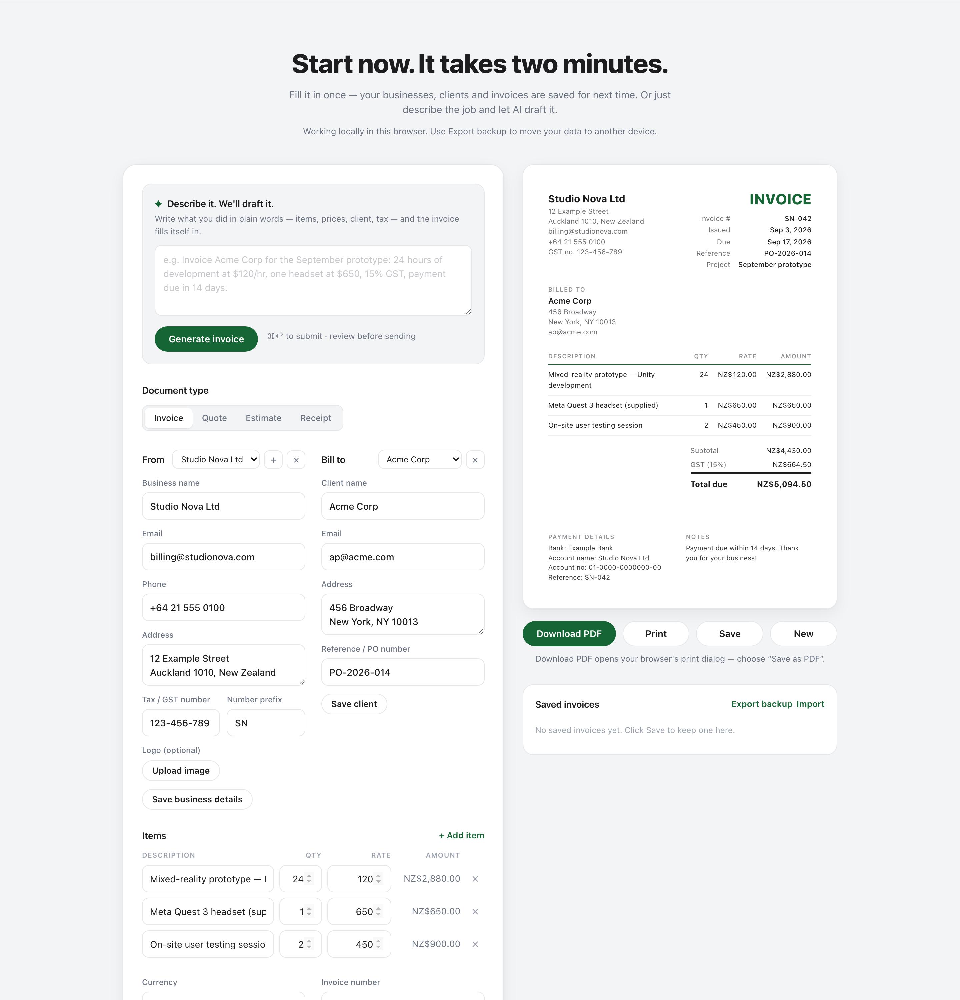
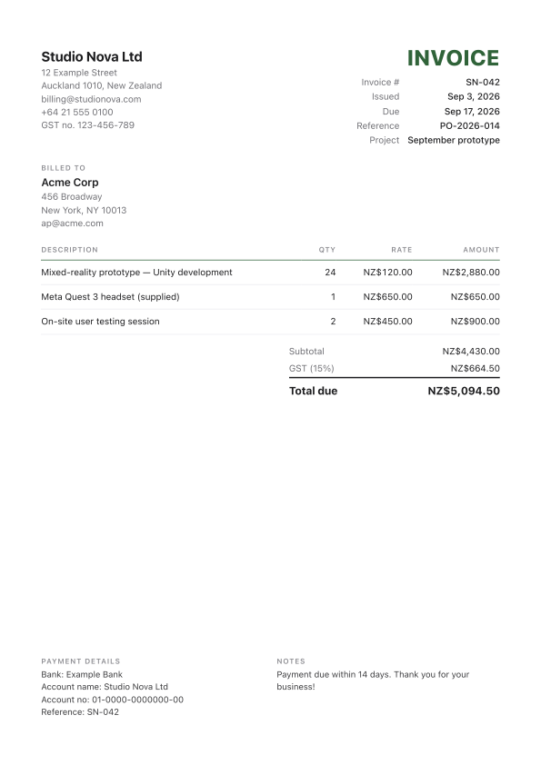

# PromptInvoice

**Free invoice generator with AI drafting and shared team workspaces. No build step, no accounts required, your data stays in your browser unless you choose to sign in.**

Live: **https://invoice.flowsxr.com/**



I built this for my own invoicing across a couple of businesses and it turned out useful enough to share. It is modelled on the clean, no-nonsense flow of [Invoala](https://www.invoala.com/), with two additions I needed: **several issuing businesses in one place**, and **sign-in with a work email so a whole company can share clients and invoices**.

## What it does

- **Invoices, quotes, estimates and receipts.** Switch the document type and the labels follow (Valid until, Paid on, PAID stamp).
- **Live A4 preview and a crisp PDF.** The preview updates as you type. Download PDF prints just the invoice, one A4 page, selectable text, no watermark.
- **Describe it, and AI drafts it.** Type what you did in plain words. DeepSeek turns it into line items, client, tax and terms, then you review. No API key or setup needed.
- **Many businesses, one place.** Each business is a profile with its own logo, address, tax number, bank details, number prefix and invoice counter (`INV-001`, `INV-002`, …).
- **Client book and saved invoices.** Save clients for one-click reuse. Reopen, duplicate or delete saved invoices.
- **Sign in with your work email to share with your team.** Everyone at `@yourcompany.com` lands in the same workspace and sees the same businesses, clients and invoices. Personal addresses (Gmail, Outlook…) get a private workspace.
- **150+ currencies**, tax with an editable label (GST, VAT, sales tax), percent or fixed discount, shipping, payment-term presets, custom fields, six accent colours.
- **Backup export and import** as a JSON file, so you can move your data or hand a colleague a starting point.



<p align="center">
  
</p>

## Use it

Open the [live site](https://invoice.flowsxr.com/), or run it locally:

```bash
git clone https://github.com/prasanthsasikumar/PromptInvoice.git
cd PromptInvoice
npm start        # serves on http://localhost:8080 (plain python http.server)
```

There is no build. `index.html` plus `css/` and `js/` is the whole app. You can also just double-click `index.html`.

1. **From** — fill in your business and click *Save business details*. Add more businesses with the **+** next to the picker.
2. **Bill to** — type the client or pick a saved one. *Save client* adds it to the client book.
3. **Items** — description, qty, rate. Totals, tax, discount and shipping update live.
4. **Download PDF** — opens the browser print dialog. Choose *Save as PDF*.
5. **Save** — keeps the invoice in *Saved invoices* and bumps the business's counter.

### AI drafting

Describe the job in the **Describe it** box:

> Invoice Acme Corp for the September prototype: 24 hours of development at $120/hr, one headset at $650, 15% GST, payment due in 14 days.

The page posts the description to `/api/draft`, a small Vercel function that asks DeepSeek (`deepseek-chat`, JSON mode) for the fields and fills the form with them. The DeepSeek key stays on the server.

If you host your own copy, set `DEEPSEEK_API_KEY` in the Vercel project's environment variables (get a key at [platform.deepseek.com](https://platform.deepseek.com/)). Without it the button reports that drafting is not configured; everything else still works.

## Team sign-in (self-hosted)

Sign-in is optional and runs on a free [Supabase](https://supabase.com/) project that you own. Without it the app runs purely in the browser. To enable it on your copy:

1. Create a Supabase project. In **Authentication → Providers** make sure *Email* is enabled (magic links are on by default).
2. Open **SQL Editor**, paste the contents of [`supabase/schema.sql`](supabase/schema.sql), and run it. This creates the tables, the per-domain workspace function, and row-level-security policies so each workspace can only see its own rows.
3. In **Authentication → URL Configuration**, set *Site URL* to where you host the app (for this deployment: `https://invoice.flowsxr.com/`) and add it to *Redirect URLs*.
4. Copy the project URL and the `anon` public key from **Project Settings → API** into [`js/config.js`](js/config.js). The anon key is designed to be public; the SQL policies do the protecting.
5. Deploy. The **Sign in** button appears in the nav.

How workspaces work:

- The workspace key is the email domain. `alice@aisee.com` and `bob@aisee.com` share one workspace; the first to sign in creates it.
- Public mail providers are keyed by the full address instead, so two Gmail users never share.
- The first time you sign in to an empty workspace, the app offers to copy the businesses, clients and invoices saved in your browser into it.
- Your working draft and your API key stay local to the browser. Businesses, clients and saved invoices sync.

## Deploy

It is a static site. GitHub Pages, Netlify, Vercel, Cloudflare Pages or an S3 bucket all work. This repo is published with GitHub Pages from the `main` branch root.

## Development

```
index.html            page (landing + generator)
css/styles.css        styling and the A4 print stylesheet
js/config.js          optional Supabase credentials (empty = local mode)
js/currencies.js      ISO 4217 table
js/calc.js            pure invoice math (unit tested)
js/storage.js         localStorage store, with a cloud-workspace cache when signed in
js/auth.js            magic-link sign-in and per-domain workspace (Supabase)
js/ai.js              browser client for the drafting endpoint
api/draft.js          Vercel function: DeepSeek call, key from DEEPSEEK_API_KEY
dev.js                local server that serves the site and mounts api/ like Vercel
js/app.js             state, form binding, preview rendering, actions
supabase/schema.sql   tables, workspace function, row-level security
tests/                unit tests, headless-Chrome end-to-end tests, screenshot generator
docs/                 design spec and screenshots
```

```bash
npm start               # local server on :8080 (put DEEPSEEK_API_KEY in .env.local for drafting)
npm test                # unit tests for the money math and the drafting function
npm run test:browser    # end-to-end in headless Chrome (set CHROME=/path/to/chrome if needed)
npm run screenshots     # regenerate docs/screenshots
```

## Privacy

Local mode sends nothing anywhere. AI drafting sends your description (plus your business name, currency, tax default and saved client names) through this site's server to DeepSeek. Signing in stores your businesses, clients and saved invoices in the Supabase project of whoever hosts the site; if that is not you, treat it like any other hosted service. To be sure, host your own copy.

## License

MIT
