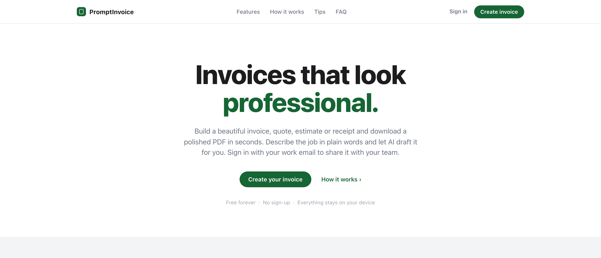
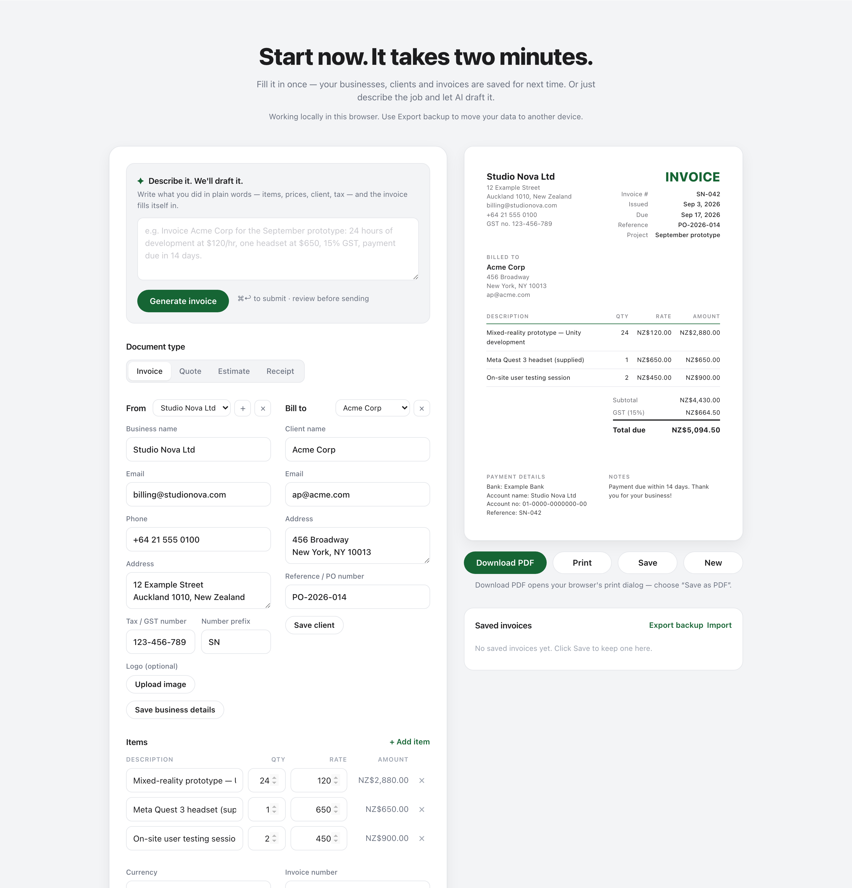
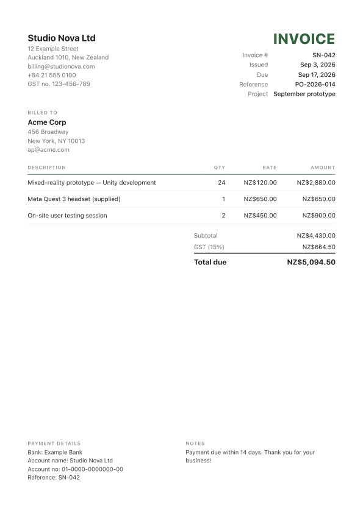

# PromptInvoice

Free invoice and payment voucher generator with AI drafting and shared team workspaces. Live at **https://invoice.flowsxr.com/**

I run a small business and needed a simple way to produce invoices and payment vouchers without paying for yet another subscription. So I built this for myself. Feel free to use it.

If you have feedback, email me at **prasanth@flowsxr.com** or open an [issue](https://github.com/prasanthsasikumar/PromptInvoice/issues) and I will try to fit it in. Or make the change yourself and send a pull request. Have a nice day.





<p align="center">
  
</p>

## What it does

- Invoices, quotes, estimates, receipts and payment vouchers, with a live A4 preview and a clean PDF.
- Describe the job in plain words and AI drafts the line items, client, tax and terms. No key or setup.
- Several businesses in one place, each with its own logo, signature, bank details and invoice counter. The signature signs vouchers as "Approved by" and appears as the authorised signature on other documents.
- Client book, saved invoices, 150+ currencies, tax, discount, shipping, custom fields.
- Sign in with a work email and everyone at your domain shares the same businesses, clients and invoices.
- Everything stays in your browser unless you sign in. Backup export and import as JSON.
- Agents can make the same PDFs with one API call. See below.

## For AI agents

Any agent (Claude, ChatGPT, a script) can create an invoice, quote, estimate, receipt or payment voucher as a finished PDF. No account, no key, nothing stored. The PDF is identical to what the Download PDF button gives you.

<p align="center">
  <a href="https://github.com/prasanthsasikumar/PromptInvoice/blob/main/docs/media/promptinvoice-for-agents.mp4">
    
  </a>
  <br>
  <sub><a href="https://github.com/prasanthsasikumar/PromptInvoice/blob/main/docs/media/promptinvoice-for-agents.mp4">Watch the 29-second demo with sound</a></sub>
</p>

<p align="center">
  
  
</p>

```bash
curl -sS https://invoice.flowsxr.com/api/pdf -H 'Content-Type: application/json' -o voucher.pdf -d '{
  "docType": "voucher", "number": "PV-2026-014",
  "from": { "name": "Studio Nova Ltd" }, "to": { "name": "Jane Contractor" },
  "items": [ { "description": "Design services, September 2026", "qty": 1, "rate": 350 } ],
  "currency": "SGD", "paymentMethod": "Bank transfer", "approvedBy": "Alex Owner"
}'
```

- **Guide for agents:** [invoice.flowsxr.com/agents](https://invoice.flowsxr.com/agents) covers every field, which document type to use, examples, error handling and rules for agents working for a person. Point your agent there.
- **Machine-readable:** `GET /api/pdf` returns the fields, limits and an example as JSON; [`/llms.txt`](https://invoice.flowsxr.com/llms.txt) is the short pointer.
- **Errors** come back as `400` with every problem listed as `{ field, message }`, so an agent can fix and retry on its own.
- Totals are always calculated from the line items, never taken from the request.


## For developers and agents

Static site, no build. `index.html` plus `css/` and `js/` is the app. Two Vercel functions: `api/draft.js` calls DeepSeek for AI drafting, and `api/pdf.js` renders PDFs for agents by printing the app's own page in headless Chromium (`@sparticuz/chromium` on Vercel, your local Chrome in development).

```bash
git clone https://github.com/prasanthsasikumar/PromptInvoice.git
cd PromptInvoice
npm start               # http://localhost:8080, serves the site and mounts api/
npm install             # puppeteer-core and @sparticuz/chromium, used only by api/pdf.js
npm test                # unit tests: invoice math, drafting, PDF API validation and handler
npm run test:browser    # end-to-end in headless Chrome, including real API renders (set CHROME=/path/to/chrome if needed)
npm run screenshots     # regenerate docs/screenshots
```

```
js/calc.js            pure invoice math
js/storage.js         localStorage store, cloud-workspace cache when signed in
js/auth.js            magic-link sign-in and per-domain workspace (Supabase)
js/ai.js              browser client for /api/draft
js/app.js             state, form binding, preview rendering, actions
api/draft.js          Vercel function: DeepSeek call, key from DEEPSEEK_API_KEY
api/pdf.js            Vercel function: document JSON in, PDF out (GET for usage)
api/_lib/document.js  validates agent input and fills defaults, listing every problem by field
api/_lib/render.js    prints the app's page to PDF in headless Chromium, offline
agents.html, llms.txt the guide for agents and its short pointer
supabase/schema.sql   tables, workspace function, row-level security
```

**Hosting your own copy.** Deploy to Vercel. Set `DEEPSEEK_API_KEY` in the project's environment variables for AI drafting (without it the button says drafting is not configured, everything else works). `vercel.json` gives the PDF function 1.7 GB of memory, 30 seconds and the app files it renders with. For team sign-in, create a free Supabase project, run `supabase/schema.sql` in its SQL editor, set the Site URL under Authentication to your domain, and put the project URL and anon key in `js/config.js`. Leave both empty for local-only mode.

**Privacy.** Local mode sends nothing anywhere. AI drafting sends your description, business name, currency, tax default and saved client names through the server to DeepSeek. Signing in stores businesses, clients and saved invoices in the host's Supabase project. The PDF API keeps nothing: it renders the document and discards it, and the page it renders cannot reach other websites. **Analytics:** when a Google Analytics Measurement ID is configured, the site records page views and a few product events (document type, currency) with GA's approximate location, and the API records one anonymous event per request (status, document type, currency, line count, caller type, country / region / city from the IP). Never names, amounts or document text. Leave `gaMeasurementId` in `js/config.js` and the `GA_MEASUREMENT_ID` / `GA_API_SECRET` environment variables empty to turn it off.

## License

MIT
